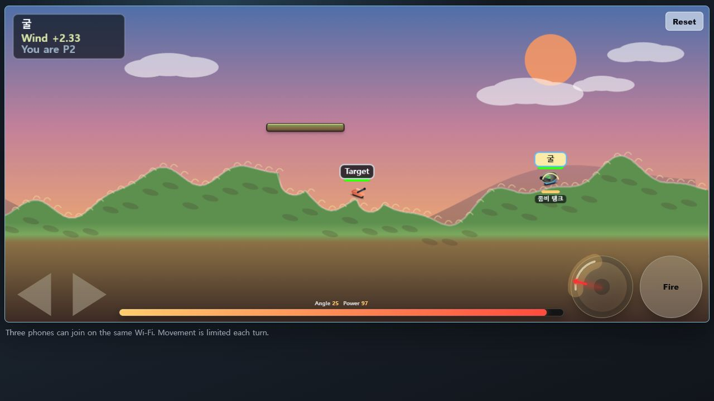

# Sky Battery

Sky Battery is a local Wi-Fi browser artillery game developed by Eugene Back and Seohyun Back. One PC runs the Python server, and phones or browsers on the same network join as clients.

## Gameplay Snapshot



Sky Battery uses a wide 20:9 battlefield with destructible terrain, floating platforms, wind, turn-based movement, and touch-friendly fire controls.

## Requirements

- Windows, macOS, or Linux with Python 3 installed
- Modern browser such as Chrome, Edge, or Safari
- All phones/clients connected to the same Wi-Fi as the server PC

No npm install or build step is required.

## Start The Server

From the project directory:

```powershell
cd C:\Users\Tower\Desktop\projects\sky-battery
python server.py
```

The server listens on port `4173`.

Local PC access:

```text
http://127.0.0.1:4173
```

Host control page:

```text
http://127.0.0.1:4173/host.html
```

## Connect From Phones

Find the server PC's Wi-Fi IP address:

```powershell
ipconfig
```

Look for the IPv4 address on the active Wi-Fi adapter, then open this on each phone:

```text
http://<server-ip>:4173
```

Example:

```text
http://192.168.0.2:4173
```

The host page is:

```text
http://<server-ip>:4173/host.html
```

## Run The Server On Android

You can run the current Python server directly on an Android phone with Termux. This keeps the existing code path and does not require an APK.

### Fresh Termux Setup

1. Install Termux on the Android phone that will host the game.
   - Recommended source: F-Droid
   - Avoid old or incompatible Termux builds if package installs fail.
2. Open Termux.
3. Update Termux packages:

```bash
pkg update
pkg upgrade
```

If Termux asks a question during update or upgrade, press `y` and Enter.

Fresh Termux does not include Git or Python, so install both:

```bash
pkg install git python
```

Check that they installed correctly:

```bash
git --version
python --version
```

Download Sky Battery:

```bash
git clone https://github.com/becxer/sky-battery.git
cd sky-battery
```

Start the server:

```bash
python server.py
```

Keep Termux open while playing. On the server phone, open Chrome and visit:

```text
http://127.0.0.1:4173
```

The host page on the server phone is:

```text
http://127.0.0.1:4173/host.html
```

### Join From Other Phones

All phones must be on the same Wi-Fi. Find the Android server phone's Wi-Fi IP address in Android Wi-Fi details, or run this in Termux:

```bash
ip -4 addr show wlan0
```

Other phones on the same Wi-Fi should open:

```text
http://<android-phone-ip>:4173
```

Example:

```text
http://192.168.0.25:4173
```

For longer games, keep the server phone awake or run this before starting the server:

```bash
termux-wake-lock
```

After playing, release it with:

```bash
termux-wake-unlock
```

## Host Flow

1. Open `/host.html`.
2. Choose player count from `1` to `6`.
3. Press `Start World`.
4. Each player opens the game URL and enters a name.
5. In one-player mode, the player can choose a tank type and fight a dummy target.

Pressing `Recreate World` returns everyone to setup and generates a fresh map.

## Controls

- Hold left/right buttons to move.
- Drag the angle dial to aim.
- Hold Fire to charge power, then release to shoot.
- Keyboard: left/right arrows or `A`/`D` move, up/down arrows adjust angle, Space charges and fires.
- Surrender is a majority vote; KO players are counted automatically and the visible counter shows votes needed before the world resets.
- During cruise missile flight, Space or Fire applies lift.
- During plane flight, Space or Fire drops three forward-falling missiles once.

## Tank Types

| Tank | Role |
| --- | --- |
| Normal Tank / 노말 탱크 | Standard single-shot tank with balanced damage and blast size. |
| Shield Tank / 쉴드 탱크 | Deals 80% normal damage, blocks one incoming attack, then recharges after two turns. |
| Triple Missile / 멀티미사일 탱크 | Fires three shells at slight angle offsets for wider coverage. |
| Red Core / 빨콩탱크 | Fires a small red round with very high direct damage and a tight blast. |
| Seeker / 유도탄 탱크 | Fires a small green missile that locks onto nearby targets while falling. |
| Howitzer / 자주포 탱크 | Projectile grows with flight time, increasing visible size, damage, and blast radius. |
| Laser / 레이저 탱크 | Shoots an instant beam that carves terrain along its path. |
| Dragon Tank / 드래곤 탱크 | Black close-range tank that breathes a short line of fire for 30-36 area damage. |
| 3-Cushion Chain / 3쿠션 체인 탱크 | Bounces off terrain up to three times, slightly steering each bounce toward the nearest tank. |
| Poop Tank / 똥탱크 | Adds poop stacks that reduce movement and increase later poop damage. |
| Squid Tank / 오징어탱크 | Deals near-normal damage and inks the target; that player's next turn is obscured by dark circular ink spots. |
| Nuke Tank / 핵폭탄 탱크 | Marks a target point first; hitting the same point again triggers a huge blast. |
| Cruise Missile / 순항미사일 탱크 | Launches a slow missile; Fire or Space applies lift during flight. |
| Plane Tank / 비행기탱크 | Launches a small, fast, straight-flying plane; pressing Fire or Space once drops three 15-degree missiles while the plane can keep flying or crash-explode. |
| Orca Tank / 범고래탱크 | Fires a tail-flapping orca from a glass tank; after landing near a target, it swims along the ground, bites once for about 70% normal damage, and leaves no crater. |
| Cat Tank / 고양이탱크 | Shares one field cat among all cat tanks; food shots call the cat to run there, scratching every tank along its path. |
| Cheese Tank / 치즈 탱크 | Cheese projectile splits repeatedly; hit tanks gain cheese stacks, grow visibly larger, and become easier to hit. |
| Zombie Tank / 좀비 탱크 | Throws a stone that releases a zombie near impact; zombies can be shot down, and retire after dealing about one normal shell of total damage. |
| Healing Tank / 힐링탱크 | Deals reduced damage, but self-hits restore part of missing health with a sparkle effect. |
| Heart Tank / 하트탱크 | Fires a pink heart; pressing Fire or Space changes its size, with a rare giant heart. |
| Pujik Tank / 뿌직탱크 | Launches a butt-shaped projectile that can stop midair and drop poop. |
| Boing Tank / 또잉탱크 | Hitting terrain jumps the tank to that point; tank-hit damage scales uniformly from 5 nearby to 70 at half-map distance or more. |
| Ball Tank / 볼탱크 | Fires white balls that split, then merge into larger falling balls. |
| Super Tank / 슈퍼탱크 | Fixed 1-in-20 chance rainbow homing missile tank with five guided shots. |

## Troubleshooting

- If phones cannot connect, confirm they are on the same Wi-Fi and use the PC's Wi-Fi IPv4 address.
- If Android is hosting the server, confirm the hosting phone is not asleep and that the Wi-Fi network allows devices to reach each other.
- If port `4173` is already in use, stop the old Python server process and run `python server.py` again.
- If the browser shows an old UI, refresh the page or close and reopen the tab.
- If the server file changes, restart the server.

## Development Notes

Before changing server logic, run:

```powershell
python -m py_compile server.py
```

Main files:

- `server.py`: game state, physics, terrain, weapons, HTTP/SSE server
- `game.js`: canvas rendering, input, sound, client state updates
- `index.html`, `style.css`: game UI
- `host.html`, `host.js`: host setup page
- `assets/`: tank and projectile assets

## Authors

- Eugene Back
- Seohyun Back
